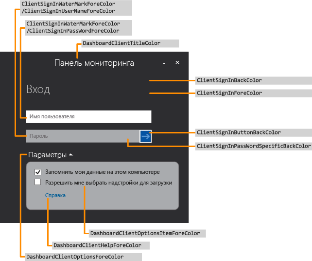
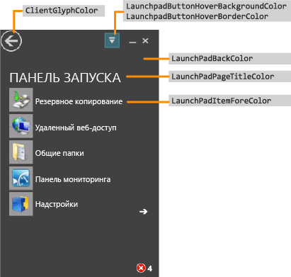
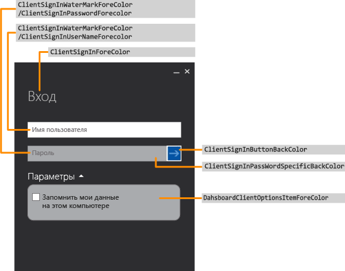
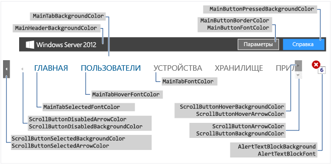
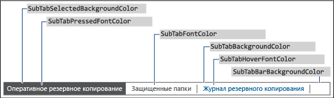
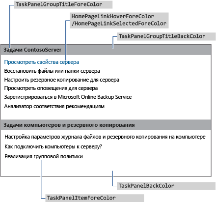
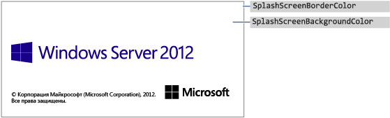
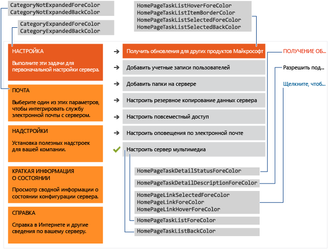

# <a name="change-the-color-scheme-of-the-dashboard-and-launchpad"></a>Изменение цветовой схемы панели администрирования и панели запуска

>Область применения: Windows Server 2016 Essentials, Windows Server 2012 R2 Essentials, Windows Server 2012 Essentials

Цветовую схему панели администрирования и панели запуска можно изменить. Для этого необходимо задать требуемые цвета в XML-файле, установить этот файл в папку на сервере и указать имя файла в записи реестра.

## <a name="create-the-xml-file"></a>Создание XML-файла
 В следующем примере показано возможное содержимое XML-файла.

```xml
<DashboardTheme xmlns="https://www.microsoft.com/HSBS/Dashboard/Branding/2010">

  <!-- Hex color values overwriting default SKU theme colors -->

    <SplashScreenBackgroundColor HexValue="FFFFFFFF"/>
    <SplashScreenBorderColor HexValue="FF000000"/>
    <MainHeaderBackgroundColor HexValue="FF414141"/>
    <MainTabBackgroundColor HexValue="FFFFFFFF"/>
    <MainTabFontColor HexValue="FF999999"/>
    <MainTabHoverFontColor HexValue="FF0072BC"/>
    <MainTabSelectedFontColor HexValue="FF0072BC"/>
    <MainButtonPressedBackgroundColor HexValue="FF0072BC"/>
    <MainButtonFontColor HexValue="FFFFFFFF"/>
    <MainButtonBorderColor HexValue="FF6E6E6E"/>
    <ScrollButtonBackgroundColor HexValue="FFF0F0F0"/>
    <ScrollButtonArrowColor HexValue="FF999999"/>
    <ScrollButtonHoverBackgroundColor HexValue="FF999999"/>
    <ScrollButtonHoverArrowColor HexValue="FF6E6E6E"/>
    <ScrollButtonSelectedBackgroundColor HexValue="FF6E6E6E"/>
    <ScrollButtonSelectedArrowColor HexValue="FFFFFFFF"/>
    <ScrollButtonDisabledBackgroundColor HexValue="FFF8F8F8"/>
    <ScrollButtonDisabledArrowColor HexValue="FFCCCCCC"/>
    <AlertTextBlockBackground HexValue="FFFFFFFF"/>
    <AlertTextBlockFont HexValue="FF000000"/>
    <FontColor HexValue="FF000000"/>
    <SubTabBarBackgroundColor HexValue="FFFFFFFF"/>
    <SubTabBackgroundColor HexValue="FFFFFFFF"/>
    <SubTabSelectedBackgroundColor HexValue="FF414141"/>
    <SubTabBorderColor HexValue="FF787878"/>
    <SubTabFontColor HexValue="FF787878"/>
    <SubTabHoverFontColor HexValue="FF0072BC"/>
    <SubTabPressedFontColor HexValue="FFFFFFFF"/>
    <ListViewColor HexValue="FFFFFFFF"/>
    <PageBorderColor HexValue="FF999999"/>   
    <LaunchpadButtonHoverBorderColor HexValue="FF6BA0B4"/>
    <LaunchpadButtonHoverBackgroundColor HexValue="FF41788F"/>
    <ClientArrowColor HexValue="FFFFFFFF"/>
    <ClientGlyphColor HexValue="FFFFFFFF"/>
    <SplitterColor HexValue="FF83C6E2"/>
    <HomePageBackColor     HexValue="FFFFFFFF"/>
    <CategoryNotExpandedBackColor HexValue="FFFFB343"/>
    <CategoryExpandedBackColor HexValue="FFF26522"/>
    <CategoryNotExpandedForeColor HexValue="FF2A2A2A"/>
    <CategoryExpandedForeColor HexValue="FFFFFFFF"/>
    <HomePageTaskListForeColor    HexValue="FF2A2A2A"/>
    <HomePageTaskListBackColor HexValue="FFEAEAEA"/>
    <HomePageTaskListHoverForeColor      HexValue="FF2A2A2A"/>
    <HomePageTaskListItemBorderColor     HexValue="FF999999"/>
    <HomePageTaskListSelectedForeColor   HexValue="FFFFFFFF"/>
    <HomePageTaskListSelectedBackColor   HexValue="FFF26522"/>
    <HomePageTaskDetailStatusForeColor   HexValue="FFF26522"/>
    <HomePageTaskDetailDescriptionForeColor     HexValue="FF2A2A2A"/>
    <HomePageLinkForeColor HexValue="FF0072BC"/>
    <HomePageLinkSelectedForeColor HexValue="FF0054A6"/>
    <HomePageLinkHoverForeColor   HexValue="FF0072BC"/>
    <PropertyFormForeColor HexValue="FF2A2A2A"/>
    <PropertyFormTabHoverColor HexValue="FF0072BC"/>
    <PropertyFormTabSelectedColor HexValue="FFFFFFFF"/>
    <PropertyFormTabSelectedBackColor HexValue="FF414141"/>
    <TaskPanelBackColor HexValue="FFFFFFFF"/>
    <TaskPanelItemForeColor HexValue="FF2A2A2A"/>
    <TaskPanelGroupTitleForeColor HexValue="FF2A2A2A"/>
    <TaskPanelGroupTitleBackColor HexValue="FFCCCCCC"/>
    <DashboardClientBackColor HexValue="FF004050"/>
    <DashboardClientTitleColor HexValue="FFFFFFFF"/>
    <DashboardClientOptionsForeColor HexValue="FFFFFFFF"/>
    <DashboardClientOptionsItemForeColor HexValue="FF2A2A2A"/>
    <DashboardClientHelpForeColor HexValue="FF0054A6"/>
    <ClientSignInForeColor HexValue="FFFFFFFF"/>
    <ClientSignInWaterMarkForeColor HexValue="FF999999"/>
    <ClientSignInUserNameForeColor HexValue="FF2A2A2A"/>
    <ClientSignInPassWordSpecificBackColor HexValue="FFCCCCCC"/>
    <ClientSignInButtonBackColor HexValue="FF004050"/>
    <ClientSignInPassWordForeColor HexValue="FF2A2A2A"/>
    <LaunchPadBackColor HexValue="FF004050"/>
    <LaunchPadPageTitleColor HexValue="FFFFFFFF"/>
    <LaunchPadItemForeColor HexValue="FFFFFFFF"/>
  <LaunchPadItemHoverColor HexValue="33FFFFFF"/>
  <LaunchPadItemIconBackgroundColor HexValue="F2004050"/>
</DashboardTheme >

```

> [!IMPORTANT]
>  XML-элементы необходимо указывать в том же порядке, что и в предыдущем примере.

> [!NOTE]
>  Все значения атрибута HexValue являются примерами шестнадцатеричных значений цветов. Можно ввести шестнадцатеричное значение любого цвета, который требуется использовать.

 Используя Блокнот или Visual Studio 2010, создайте XML-файл, содержащий теги для областей, которые требуется настроить. Можно задать любое имя файла, но он должен иметь расширение XML. Описание областей, которые можно настраивать на панели администрирования и панели запуска, см в [соответствующем разделе](Change-the-Color-Scheme-of-the-Dashboard-and-Launchpad.md#BKMK_Dashboard).

#### <a name="to-install-the-xml-file"></a>Установка XML-файла

1.  На сервере переместите указатель мыши в правый верхний угол экрана и нажмите кнопку **Поиск**.

2.  В поле поиска введите **regedit**, затем щелкните приложение **Regedit**.

3.  В левой области последовательно разверните узлы **HKEY_LOCAL_MACHINE**, **SOFTWARE**, **Microsoft** и **Windows Server**. Если раздел **OEM** не существует, необходимо создать его, выполнив следующие действия.

    1.  Щелкните правой кнопкой мыши узел **Windows Server**, выберите команду **Создать** и щелкните пункт **Раздел**.

    2.  В качестве имени раздела введите **OEM**.

4.  Щелкните правой кнопкой мыши раздел **OEM**, выберите команду **Создать** и щелкните пункт **Строковый параметр**.

5.  Введите **CustomColorScheme** в качестве имени строки и нажмите клавишу **Ввод**.

6.  Щелкните правой кнопкой мыши **CustomColorScheme** в правой панели, а затем выберите опцию **Изменить**.

7.  Введите имя файла, а затем нажмите кнопку **ОК**.

8.  Скопируйте файл в папку %programFiles%\Windows Server\Bin\OEM. Если каталог OEM не существует, создайте его.

##  <a name="dashboard-and-launchpad-areas-that-can-be-changed"></a><a name="BKMK_Dashboard"></a>Области панелей мониторинга и панели запуска, которые можно изменить
 В этом разделе приведены примеры областей панели администрирования и панели запуска, которые можно настраивать.

### <a name="examples"></a>Примеры

####  <a name="figure-1-sign-in-page-of-the-dashboard"></a><a name="BKMK_Figure1"></a>Рис. 1. страница входа панели мониторинга
 

####  <a name="figure-2-launchpad"></a><a name="BKMK_Figure2"></a>Рис. 2. Панель запуска
 

####  <a name="figure-3-sign-in-page-of-the-launchpad"></a><a name="BKMK_Figure3"></a>Рис. 3. страница входа в панель запуска
 

####  <a name="figure-4-dashboard-text"></a><a name="BKMK_Figure4"></a>Рис. 4. текст панели мониторинга
 

####  <a name="figure-5-subtab-border"></a><a name="BKMK_Figure5"></a>Рис. 5. граница подчиненного
 

####  <a name="figure-6-task-pane"></a><a name="BKMK_Figure6"></a>Рис. 6. область задач
 

####  <a name="figure-7a-product-splash-screen"></a><a name="BKMK_Figure9"></a>Рисунок 7а. экран-заставка продукта
 

#### <a name="figure-7b-home-page"></a>Рис. 7b: Домашняя страница
 

## <a name="see-also"></a>См. также:
 [Создание и Настройка образа](Creating-and-Customizing-the-Image.md) [Дополнительные настройки](Additional-Customizations.md) [Подготовка образа для развертывания](Preparing-the-Image-for-Deployment.md) [Тестирование взаимодействия с пользователем](Testing-the-Customer-Experience.md)